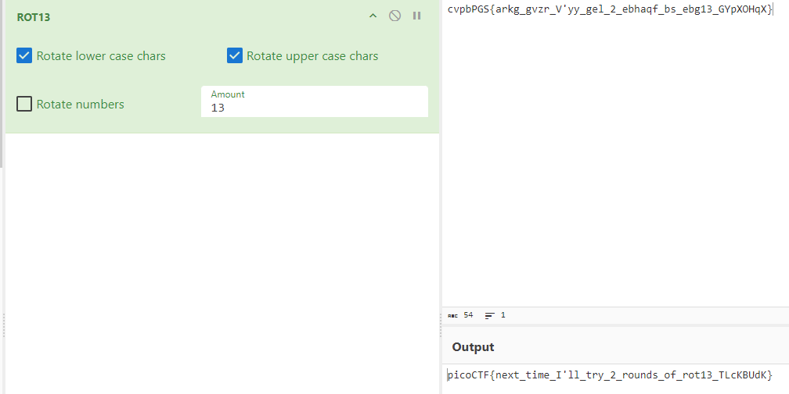

# Challenge name
#### <ins>Description</ins>
> Cryptography can be easy, do you know what ROT13 is?

#### <ins>Hints</ins>
> This can be solved online if you don't want to do it by hand!

For this challenge im going to use a website called [CyberChef](https://gchq.github.io/CyberChef/)

> cvpbPGS{arkg_gvzr_V'yy_gel_2_ebhaqf_bs_ebg13_GYpXOHqX}

Use ROT13 from the list on the left, and insert the text on the right:

### Flag: picoCTF{next_time_I'll_try_2_rounds_of_rot13_TLcKBUdK}